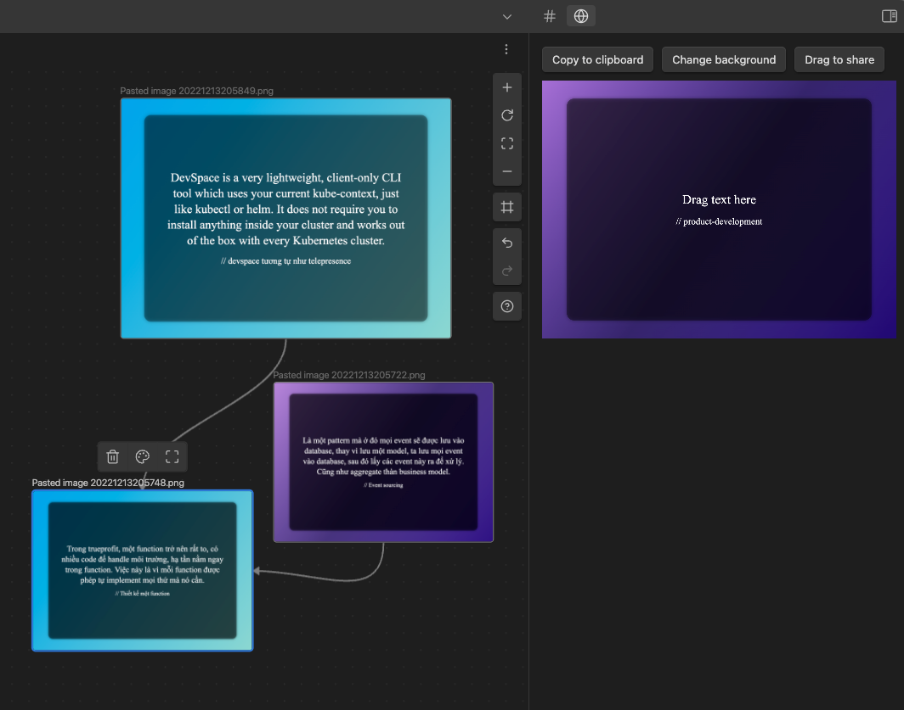

# Obsidian Disable Plugin Temporarily

This plugin is for debugging purposes.

It gives you two commands: Enable plugins and Disable plugins.

When using the disable plugins command, any active plugins will be disabled.

When using the enable plugins command, any plugins disabled by the plugin will be enabled

## Usage

1. Open the command palette (Ctrl/Cmd + P)
2. Type "Disable plugins" or "Enable plugins"
3. Press enter
